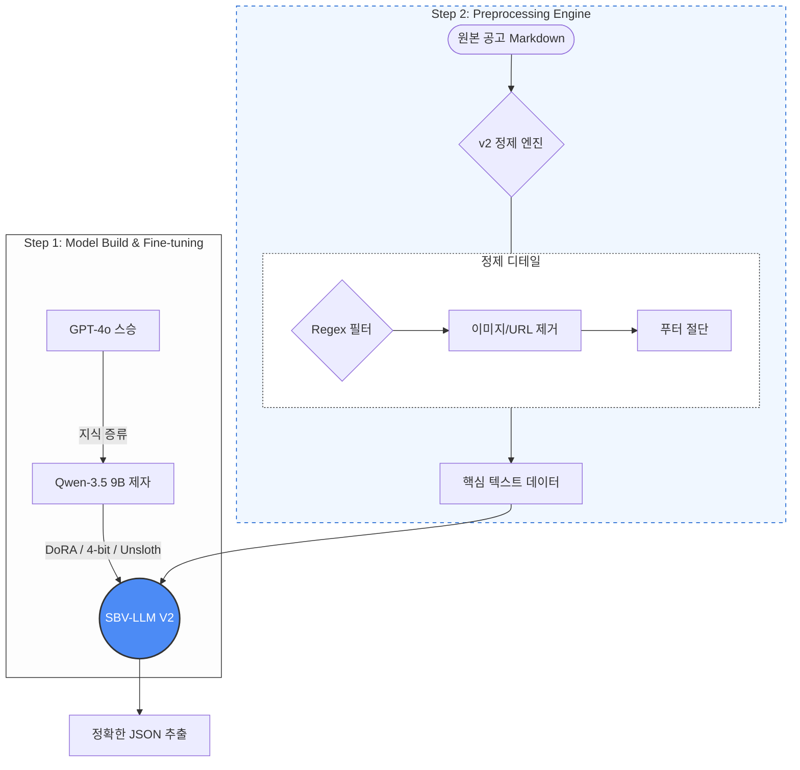

# 🐝 SBeeV-LLM: 채용 정보 JSON 추출 엔진

> **비정형 채용 공고 마크다운 데이터로부터 고정밀 JSON 구조를 추출하는 도메인 특화 LLM 파이프라인**


## 프로젝트 개요
이 프로젝트는 채용 사이트의 비정형 마크다운 데이터에서 핵심 정보(기업명, 포지션, 기술 스택 등)를 구조화된 JSON으로 변환하는 데 최적화되어 있습니다. **DoRA(Weight-Decomposed Low-Rank Adaptation) 파인튜닝**과 **강력한 전처리 엔진**을 결합하여, GPT-4o-mini와 같은 범용 모델보다 높은 정확도와 안정성을 로컬 환경에서 구현했습니다.

## 핵심 아키텍처


## 주요 특징
- **DoRA 미세 조정:** 12GB VRAM 제약 환경에서도 Qwen-3.5 (9B) 모델의 성능을 극대화.
- **고순도 데이터 정제:** 원문의 **노이즈 82.1%를 제거**(이미지, URL, 추천 링크 등)하여 모델의 할루시네이션 및 무한 루프 방지.
- **100% 추론 안정성:** 100개 공고 벌크 추출 테스트에서 **JSON 형식 준수율 100%** 달성.
- **범용 모델 능가:** GPT-4o-mini 대비 F1 추출 스코어 **41.8% 향상**.
- **완전 로컬 추론:** Ollama 및 GGUF 양자화를 통해 API 비용 제로화 및 데이터 보안 확보.

## 기술 스택
- **언어 및 프레임워크:** Python 3.10+, PyTorch
- **모델:** Qwen-3.5 (9B) 기반 -> **SBV-LLM-V2 (Fine-tuned)**
- **학습:** Unsloth (DoRA), HuggingFace
- **배포:** Ollama (GGUF Quantization)
- **평가:** GPT-4o-mini (벤치마크 비교 대상), Scikit-learn (F1 Score 측정)

## 성능 벤치마크 결과 (N=100)
| 지표 | Qwen-3.5 (Base) | GPT-4o-mini (General) | **SBV-LLM-V2 (Ours)** |
| :--- | :---: | :---: | :---: |
| **F1 스코어** | 0.0000 | 0.4242 | **0.6017** |
| **평균 응답 속도** | 2.53s | 2.36s | **2.11s** |
| **JSON 유효성** | 0% | 100% | **100%** |

> **Insight:** 사전 학습된 Base 모델은 JSON 구조화에 완전히 실패하였으나, DoRA 미세 조정을 통해 범용 대형 모델을 상회하는 성능을 확보했습니다.

## 데이터 정제 전략: "82.1%의 노이즈 제거"
채용 공고 원문에는 배너 이미지, 추천 공고 링크, 프로모션 문구 등 추출과 무관한 데이터가 다수 포함되어 있습니다.
- **전처리 전:** 평균 15,329자, 이미지 40개, 링크 52개 포함.
- **전처리 후:** 평균 3,856자 (핵심 내용 보존, 이미지/링크 완전 제거).
- **효과:** **토큰 사용량 80% 절감** 및 무한 루프로 인한 "Unterminated String" 에러 해결.

## 프로젝트 구조
```text
.
├── configs/
│   └── train_config_v2.yaml  # DoRA 파인튜닝 하이퍼파라미터 설정
├── data/
│   ├── raw/                  # 원본 채용 공고 마크다운 데이터
│   ├── labeled/              # GPT-4o 기반 고순도 학습 데이터셋 (JSONL)
│   ├── splits_v2/            # 학습/검증/테스트 데이터 분할본
│   └── inference_results/    # 추출된 JSON 결과 및 성능 시각화 차트
├── models/
│   └── sbv-dora-adapter-v2/  # 학습 완료된 DoRA 어댑터 가중치
├── scripts/
│   ├── 05_train_dora_v2.py   # 최적화 학습 실행 스크립트
│   ├── 07_evaluate_v2.py     # 성능 벤치마킹 및 지표 측정
│   ├── 09_bulk_inference_v2.py # 고속 벌크 정보 추출 엔진
│   └── 13_visualize_benchmark.py # 결과 분석 및 시각화 도구
├── Modelfile_v2              # Ollama 배포 및 양자화 설정
└── README.md
```

## 사용 방법
```bash
# 1. Ollama 모델 빌드
ollama create sbv-llm-v2 -f Modelfile_v2

# 2. 벌크 추론 실행 (JSON 추출)
python scripts/09_bulk_inference_v2.py

# 3. 성능 평가 실행
python scripts/07_evaluate_v2.py
```
