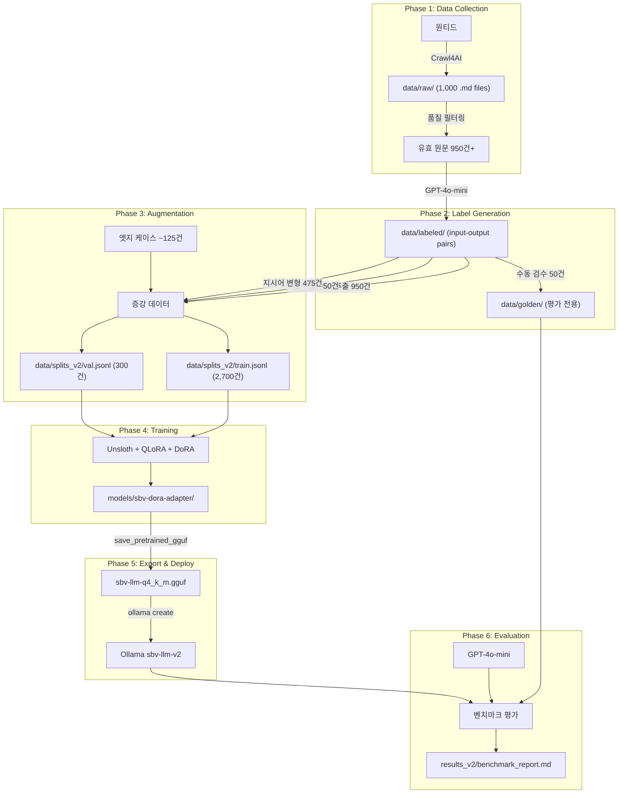
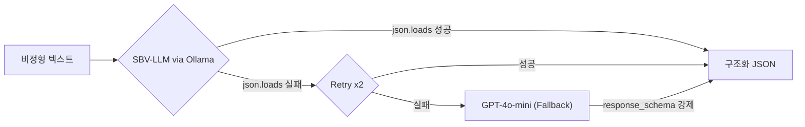

# Flow: SBV-LLM Pipeline

## End-to-End Flow

## Inference Flow (Runtime)

## Augmentation Strategy

| 유형 | 변환 | 입력 → 출력 | 건수 |
|------|------|------------|:----:|
| 전체 추출 | 원본 그대로 | 원문 → 전체 JSON | 950 |
| 부분 추출 | 지시어 변경 | 원문 → `{tech_stack, experience}` only | 950 |
| 지시어 변형 | 프롬프트 3종 | 동일 원문, 다른 지시어 → 동일 JSON | 475 |
| 엣지 케이스 | null 다수 | 비개발/불완전 공고 → null 필드 | ~125 |

## Key Invariants
- 골든 50건은 **절대** 학습 데이터에 포함되지 않음
- 모든 학습 데이터는 `json.loads()`로 파싱 가능해야 함
- 크롤링 요청 간격 ≥ 2초, 동시 요청 1개
